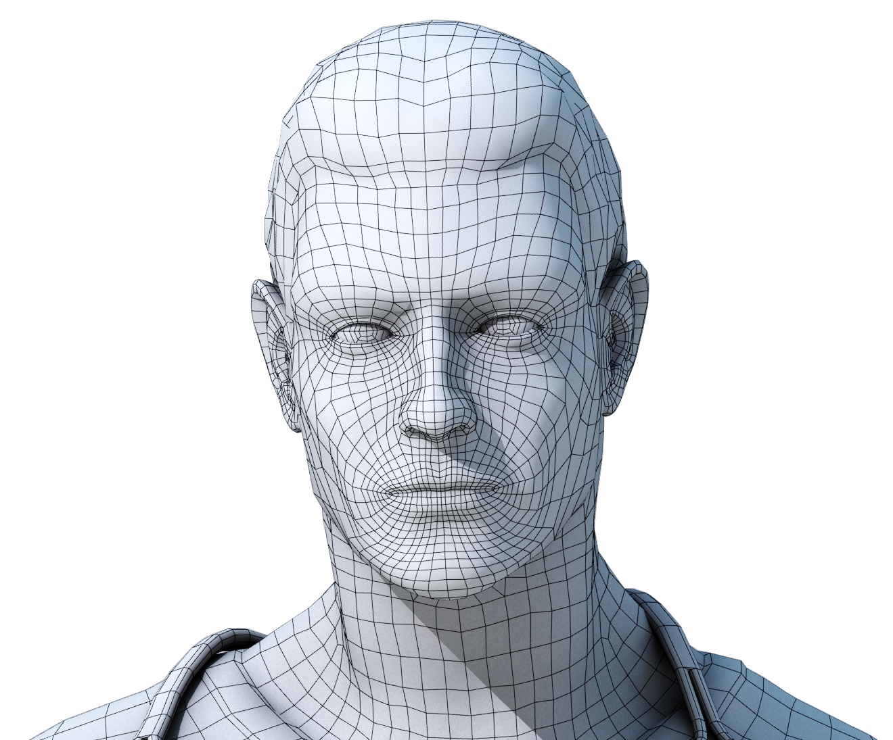

English | [Tajik](./README.Tj-Tajik.md)

<div align="center">



<h1 align="center">Face Detection and Recognition with C# EmguCV</h1>

</div>


### What is Emgu CV?

Emgu CV is a cross platform .Net wrapper to the OpenCV image processing library. Allowing OpenCV functions to be called from .NET compatible languages such as C#, VB, VC++, IronPython etc. The wrapper can be compiled by Visual Studio, Xamarin Studio and Unity, it can run on Windows, Linux, Mac OS X, iOS, Android and Windows Phone.

### Algorithms


<br/>

**_Eigenfaces_** refers to an appearance-based approach to face recognition that seeks to capture the variation in a collection of face images and use this information to encode and compare images of individual faces in a holistic (as opposed to a parts-based or feature-based) manner.

Specifically, the eigenfaces are the principal components of a distribution of faces, or equivalently, the eigenvectors of the covariance matrix of the set of face images, where an image with N pixels is considered a point (or vector) in N-dimensional space. The idea of using principal components to represent human faces was developed by Sirovich and Kirby (Sirovich and Kirby 1987) and used by Turk and Pentland (Turk and Pentland 1991) for face detection and recognition.

The Eigenface approach is considered by many to be the first working facial recognition technology, and it served as the basis for one of the top commercial face recognition technology products. Since its initial development and publication, there have been many extensions to the original method and many new developments in automatic face recognition systems. Eigenfaces is still often considered as a baseline comparison method to demonstrate the minimum expected performance of such a system.

The **_Viola–Jones_** object detection framework is the first object detection framework to provide competitive object detection rates in real-time proposed in 2001 by Paul Viola and Michael Jones. Although it can be trained to detect a variety of object classes, it was motivated primarily by the problem of face detection.


### Requirements

- [Visual Studio](https://visualstudio.microsoft.com/)
- Min [EmguCV 2.2.1](https://sourceforge.net/projects/emgucv/files/emgucv/2.2.1/)


### Hot to Run?

- Download or clone project

```sh
git clone https://github.com/ShOtabekov/FaceRecognitionWPF.git
```

- Update the **./Config.cs** file to change configuration settings.
- Build and run project with Visual Studio (Suggested 2017+ version)


### Video
</a>
